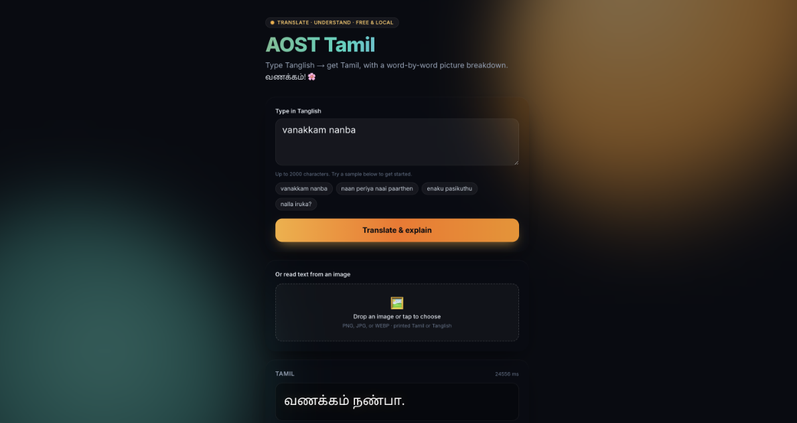

# AOST Tamil — Tanglish → Tamil, with understanding 🌸

> Type **Tanglish** (Tamil in English letters) → get correct **Tamil**, broken down
> word-by-word with **part of speech + meaning + a picture emoji** so kids actually
> _understand_ it. Read text straight from a **photo**. 100% **free and local** — no
> API keys, no cloud, runs on your own machine.

Built for the **Tanglish-to-Tamil Translator** hackathon (Students track), under the
[Academy of Smart Thinkers](https://www.academyofsmartthinkers.com/).



---

## What it does

| Feature                            | Example                                                                                                     |
| ---------------------------------- | ----------------------------------------------------------------------------------------------------------- |
| **1. Understand-and-translate**    | `nettru naan nadakumboothu oru naai kuraichuthu` → **நேற்று நான் நடந்துகொண்டிருந்தபோது ஒரு நாய் குரைத்தது** |
| **2. Pictorial grammar breakdown** | 🙋 நான் `pronoun` "I" · 🐶 நாய் `noun` "dog" · 🗣️ குரைத்தது `verb` "barked"                                 |
| **3. Image OCR**                   | Drop a photo of printed Tamil/Tanglish → text is extracted and translated                                   |

It doesn't just transliterate letter-by-letter (which gets `nettru` wrong as
`நெட்ரு`). It **understands the sentence** and writes natural Tamil — then explains
the grammar with colours and pictures so a learner can follow along.

---

## How the models work (the "merge")

Each step uses the open model that is best at it — all served locally by **Ollama**:

```
 Tanglish text ─┐
 (or a photo) ──┤
                ▼
        ┌───────────────┐   image
        │  Tesseract 5  │◀── OCR (Tamil + Latin)
        └──────┬────────┘
               ▼ text
        ┌──────────────────────────┐
        │  gemma2:9b  (Ollama)      │  ① understand casual phonetic Tanglish
        │  meaning-based prompt     │     → correct, natural Tamil
        └──────┬───────────────────┘
               ▼ Tamil sentence
        ┌──────────────────────────┐
        │  gemma2:9b  (Ollama)      │  ② per-word breakdown → JSON
        │  POS + gloss + emoji      │     {tamil, pos, gloss, emoji}
        └──────┬───────────────────┘
               ▼
     Next.js UI: translation + colour-coded pictorial grammar cards
```

- **Translation** — `gemma2:9b` with a meaning-based, few-shot prompt that teaches the
  common phonetic spellings, fixes verb tenses, and preserves negation. (We also ship
  a `sarvam` backend wrapping
  [`sarvamai/sarvam-translate`](https://huggingface.co/sarvamai/sarvam-translate), but
  found it too literal for casual Tanglish — gemma2 understands meaning far better.)
- **Grammar / structure** — a second `gemma2` call returns each word's part of speech,
  a short English gloss, and one picture emoji.
- **OCR** — Tesseract 5 (LSTM, `tam+eng`), CPU-only.

Everything is **pluggable** behind small Python packages, so a model can be swapped
with one env var (`OLLAMA_MODEL`, `OCR_BACKEND`, `ANALYZE_TRANSLATE_BACKEND`).

---

## Setup & run — the easy way (2 commands)

On **macOS (Homebrew)**, **Debian/Ubuntu (apt)**, or **Windows via WSL2**
([see the Windows section](#windows-setup)), two commands do everything — install the
model runtime + model + OCR engine + all dependencies, then launch:

```bash
./scripts/setup.sh    # installs Ollama + gemma2 model + Tesseract + all deps   (or: make setup)
./scripts/run.sh      # starts the API + web app and opens your browser         (or: make demo)
```

`setup.sh` is **idempotent** (it skips anything already installed); `run.sh` starts
both servers and stops them cleanly on **Ctrl+C**. Prefer to do it by hand, on another
OS, or need to troubleshoot? The full step-by-step is right below.

> **Note:** there is no smaller "just `pip install`" option — this is a local AI app,
> so the ~5.4 GB model and the Tesseract OCR engine are external runtimes that must be
> installed on the machine (no package manager bundles a local LLM). The script above
> automates that for you.

---

## Windows setup

> ### ⚠️ Read this first — it fixes 90% of Windows errors
>
> If you see **`'ollama' is not recognized`**, **`program not found`**, or
> `'uv'/'node'/'pnpm' is not recognized`, it is **almost always** because you installed
> a tool but your **current PowerShell window still has the old PATH**.
>
> **The fix:** after every install, **close the PowerShell window and open a brand-new
> one** (Start menu → type "PowerShell" → Enter), then continue. Each step below ends
> with a `--version` check — if it prints a version, that tool is ready.

You have two paths. **Option A (WSL2) is by far the most reliable** — it avoids all the
Windows PATH issues and uses the same tested scripts as macOS/Linux.

### Option A — WSL2 (recommended)

WSL2 gives you a real Linux environment where `./scripts/setup.sh` and
`./scripts/run.sh` just work.

1. In **PowerShell (Run as Administrator)** install Ubuntu, then **restart your PC** if
   prompted:

   ```powershell
   wsl --install -d Ubuntu
   ```

2. Open **Ubuntu** from the Start menu (set a username/password the first time), then:

   ```bash
   sudo apt-get update
   git clone https://github.com/CaSc-6385/tamil-tanglish-toolkit.git
   cd tamil-tanglish-toolkit
   ./scripts/setup.sh      # installs Ollama + gemma2 model + Tesseract + all deps
   ./scripts/run.sh        # starts the API + web app
   ```

3. Open **http://localhost:3000** in your normal **Windows browser** (WSL forwards
   localhost automatically). Done.

> NVIDIA GPU? Install the Windows NVIDIA driver and WSL2 uses it automatically;
> otherwise the model runs on CPU (slower, still works).

### Option B — native Windows (PowerShell)

#### B1. One command (recommended for native)

From the project folder, in PowerShell (the `-ExecutionPolicy Bypass` is needed because
Windows blocks scripts by default):

```powershell
git clone https://github.com/CaSc-6385/tamil-tanglish-toolkit.git
cd tamil-tanglish-toolkit
powershell -ExecutionPolicy Bypass -File .\scripts\setup.ps1   # installs everything + the model
powershell -ExecutionPolicy Bypass -File .\scripts\run.ps1     # launches the app + opens browser
```

`setup.ps1` refreshes PATH after each install, so it avoids the "not recognized" trap.
(You need `git` and `winget` first — both ship with modern Windows 11; if `git` is
missing the script installs it.)

#### B2. By hand (if the script fails, or to understand each piece)

> Reminder: **close & reopen PowerShell after each `winget install`.**

##### Step 1 — Ollama (the model runtime)

```powershell
winget install -e --id Ollama.Ollama --accept-package-agreements --accept-source-agreements
```

Close PowerShell, open a **new** one, then verify:

```powershell
ollama --version
```

##### Step 1b — zstd (Windows only)

Ollama's model layers are zstd-compressed, so on a clean Windows machine `ollama pull`
can fail during extraction with a `zstd` / `program not found` error. Install it once:

```powershell
winget install -e --id Facebook.Zstandard --accept-package-agreements --accept-source-agreements
```

Close PowerShell, open a **new** one, then verify: `zstd --version`.

##### Step 2 — download the model

Ollama must be running — its installer starts it; if not, run `ollama serve` in a
separate window.

```powershell
ollama pull gemma2:9b
ollama list                # should show gemma2:9b
```

##### Step 3 — Tesseract (OCR — optional, only for the photo feature)

```powershell
winget install -e --id UB-Mannheim.TesseractOCR --accept-package-agreements --accept-source-agreements
```

In the installer, **tick "Tamil"** under _Additional language data_. Then (new
PowerShell window):

```powershell
$env:Path += ";C:\Program Files\Tesseract-OCR"   # if it isn't already on PATH
tesseract --version
```

##### Step 4 — uv (Python), Node.js, pnpm

```powershell
winget install -e --id astral-sh.uv --accept-package-agreements --accept-source-agreements
winget install -e --id OpenJS.NodeJS.LTS --accept-package-agreements --accept-source-agreements
```

Close PowerShell, open a **new** one, then:

```powershell
npm install -g pnpm
uv --version ; node --version ; pnpm --version   # all three must print a version
```

##### Step 5 — get the code + install dependencies

In a new PowerShell window:

```powershell
git clone https://github.com/CaSc-6385/tamil-tanglish-toolkit.git
cd tamil-tanglish-toolkit
uv sync --all-extras
pnpm install
```

##### Step 6 — run it

Use **two** PowerShell windows, **both** opened in the project folder
(`cd path\to\tamil-tanglish-toolkit`). Note PowerShell's `$env:` syntax:

```powershell
# Window A — the API
$env:TRANSLITERATE_BACKEND="ollama"
$env:OCR_BACKEND="tesseract"
# if OCR can't find Tesseract, also run:
# $env:TESSERACT_CMD="C:\Program Files\Tesseract-OCR\tesseract.exe"
uv run uvicorn --app-dir apps/api/src tamil_edu_api.main:app --port 8000
```

```powershell
# Window B — the web app
cd path\to\tamil-tanglish-toolkit
pnpm --filter web dev
```

Open **http://localhost:3000** (first translation takes ~15–30 s while the model loads).

#### Windows troubleshooting

| Error you see                                                               | Fix                                                                                                                           |
| --------------------------------------------------------------------------- | ----------------------------------------------------------------------------------------------------------------------------- |
| `'ollama' / 'uv' / 'node' / 'pnpm' is not recognized` · `program not found` | You installed it but PowerShell has the **old PATH** — **close and reopen PowerShell**, then `<tool> --version`.              |
| `running scripts is disabled on this system`                                | Run scripts with `powershell -ExecutionPolicy Bypass -File .\scripts\setup.ps1`.                                              |
| `winget : The term 'winget' is not recognized`                              | Install **App Installer** from the Microsoft Store (that's what provides `winget`), then reopen PowerShell.                   |
| winget: `No package found matching input criteria`                          | Update App Installer from the Store, or use the direct installer links below.                                                 |
| `ollama pull` → could not connect / connection refused                      | Ollama isn't running — open the **Ollama** app from Start, or run `ollama serve` in another window, then retry.               |
| `ollama pull` fails extracting · `zstd` / `program not found` during pull   | Model layers are zstd-compressed — `winget install -e --id Facebook.Zstandard`, reopen PowerShell (`zstd --version`), retry.  |
| OCR fails: `tesseract is not installed` / not found                         | Set `$env:TESSERACT_CMD="C:\Program Files\Tesseract-OCR\tesseract.exe"` before starting the API; check `tesseract --version`. |
| `'git' is not recognized`                                                   | `winget install -e --id Git.Git`, then reopen PowerShell.                                                                     |
| Web shows "Could not reach the server"                                      | Window A (the API on :8000) must be running. Re-check it didn't error.                                                        |

> No `winget`? Download installers directly:
> [Ollama](https://ollama.com/download/windows) ·
> [Tesseract (UB Mannheim)](https://github.com/UB-Mannheim/tesseract/wiki) ·
> [uv](https://docs.astral.sh/uv/getting-started/installation/) ·
> [Node.js](https://nodejs.org/) ·
> [Git](https://git-scm.com/download/win) ·
> [zstd](https://github.com/facebook/zstd/releases) (Windows binary, for Ollama model extraction).

---

## Manual setup — full step-by-step (for reviewers)

> This is a **local AI app**: the model runs on your own machine, so there are no API
> keys and nothing to pay for. The trade-off is a one-time setup of the model runtime.
> Follow the steps in order — each has a **verify** command so you know it worked.
> Total time: ~15–25 min, most of it the one-time model download.

### 0. What you need

| Requirement             | Why                     | Notes                                                                        |
| ----------------------- | ----------------------- | ---------------------------------------------------------------------------- |
| **~16 GB RAM**          | run the gemma2 9B model | 8 GB works with the smaller model in step 2b                                 |
| **~9 GB disk**          | model (~5.4 GB) + deps  |                                                                              |
| macOS / Linux / Windows | all supported           | Windows: see the [Windows setup](#windows-setup) (WSL2 or native PowerShell) |
| Internet                | one-time downloads      | the app itself runs fully offline afterwards                                 |

A GPU is **not required** (Apple-Silicon Macs use the GPU automatically; on a plain
CPU it just runs slower).

---

### 1. Install Ollama (the local model runtime)

**macOS:**

```bash
brew install ollama          # or download the app from https://ollama.com/download
ollama serve &               # start the background server (Homebrew install)
```

(The downloaded **Ollama.app** starts its own server automatically — if you used the
app, skip `ollama serve`.)

**Linux / WSL2:**

```bash
curl -fsSL https://ollama.com/install.sh | sh
ollama serve &               # start the server in the background
```

**Verify** Ollama is running:

```bash
curl http://localhost:11434/api/tags        # should return JSON (a {"models":[...]} list)
```

---

### 2. Download the AI model

```bash
ollama pull gemma2:9b        # ~5.4 GB, one time. This powers translation + grammar.
```

**Verify** the model answers:

```bash
ollama run gemma2:9b "Reply with one word: hello"    # prints a word, then type /bye to exit
```

**2b. Low-RAM / faster option (optional).** If you have <16 GB RAM or want faster
responses, use a smaller model and tell the app to use it:

```bash
ollama pull gemma2:2b
# then in step 5, prefix the API command with:
#   OLLAMA_MODEL=gemma2:2b GRAMMAR_MODEL=gemma2:2b
```

Quality is lower than 9B but it still works and is much faster.

---

### 3. Install Tesseract OCR + Tamil language data (for the photo feature)

**macOS:**

```bash
brew install tesseract tesseract-lang
```

**Linux / WSL2:**

```bash
sudo apt-get update && sudo apt-get install -y tesseract-ocr tesseract-ocr-tam
```

**Verify** Tamil is available:

```bash
tesseract --list-langs | grep -E '^(tam|eng)$'      # must list BOTH tam and eng
```

> The photo/OCR feature is optional — text translation works without Tesseract.

---

### 4. Install the developer tooling

| Tool            | Install                                                                                       | Verify                  |
| --------------- | --------------------------------------------------------------------------------------------- | ----------------------- |
| **uv** (Python) | `curl -LsSf https://astral.sh/uv/install.sh \| sh`                                            | `uv --version`          |
| **Node 20+**    | macOS: `brew install node` · Linux: [nodesource](https://github.com/nodesource/distributions) | `node --version` (≥ 20) |
| **pnpm**        | `npm install -g pnpm`                                                                         | `pnpm --version`        |

---

### 5. Get the code and install dependencies

```bash
git clone https://github.com/CaSc-6385/tamil-tanglish-toolkit.git
cd tamil-tanglish-toolkit

uv sync --all-extras        # installs all Python deps (FastAPI, packages, test deps)
pnpm install                # installs the web app deps
```

---

### 6. Run it (two terminals, from the repo root)

**Terminal A — the API (backend):**

```bash
TRANSLITERATE_BACKEND=ollama OCR_BACKEND=tesseract \
  uv run uvicorn --app-dir apps/api/src tamil_edu_api.main:app --port 8000
```

**Verify** the backend is up:

```bash
curl http://localhost:8000/health           # → {"status":"ok",...}
```

**Terminal B — the web app (frontend):**

```bash
pnpm --filter web dev                        # serves http://localhost:3000
```

---

### 7. Use it

Open **http://localhost:3000**, type some Tanglish (e.g. `naan periya naai paarthen`),
and click **Translate & explain**.

> ⏳ The **first** request loads the model into memory, so it can take **~15–30 s**.
> Every request after that is faster. This is normal for a local model — please wait.

**Verify the whole pipeline from the command line** (optional):

```bash
curl -s -X POST http://localhost:8000/analyze \
  -H 'Content-Type: application/json' \
  -d '{"text":"naan periya naai paarthen"}'
# → {"tamil":"நான் பெரிய நாயைப் பார்த்தேன்.","words":[{"tamil":"நான்","pos":"pronoun",...}], ...}
```

---

### Troubleshooting

| Symptom                                               | Fix                                                                                          |
| ----------------------------------------------------- | -------------------------------------------------------------------------------------------- |
| `Ollama unreachable` / 503 from `/analyze`            | Ollama isn't running — run `ollama serve` (or open Ollama.app); check `curl :11434/api/tags` |
| `model 'gemma2:9b' not found`                         | Run `ollama pull gemma2:9b` (step 2)                                                         |
| First translation is very slow / "Translating…" hangs | Normal on first call (model loading). Wait ~30 s; or use `gemma2:2b` (step 2b)               |
| OCR returns "Tesseract failed"                        | Install Tesseract + Tamil data (step 3); confirm `tesseract --list-langs` shows `tam`        |
| `Address already in use` on :8000 / :3000             | Another process is using the port: `lsof -ti :8000 \| xargs kill` then retry                 |
| Web shows "Could not reach the server"                | Make sure Terminal A (the API on :8000) is running                                           |
| Out of memory while running gemma2:9b                 | Use the smaller model: `OLLAMA_MODEL=gemma2:2b GRAMMAR_MODEL=gemma2:2b` (step 2b)            |

---

### One-shot quick reference

```bash
# prerequisites (macOS)
brew install ollama tesseract tesseract-lang node && npm i -g pnpm
curl -LsSf https://astral.sh/uv/install.sh | sh
ollama serve & ; ollama pull gemma2:9b

# build + run
git clone https://github.com/CaSc-6385/tamil-tanglish-toolkit.git && cd tamil-tanglish-toolkit
uv sync --all-extras && pnpm install
# terminal A:
TRANSLITERATE_BACKEND=ollama OCR_BACKEND=tesseract uv run uvicorn --app-dir apps/api/src tamil_edu_api.main:app --port 8000
# terminal B:
pnpm --filter web dev      # → http://localhost:3000
```

---

## Architecture

A pnpm + `uv` monorepo:

```
apps/
  web/                 Next.js 14 + Tailwind (dark, kid-friendly, accessible)
  api/                 FastAPI — POST /translate · /analyze · /ocr · /health
packages/
  transliterate/       Tanglish→Tamil backends (ollama/gemma2, sarvam, aksharamukha, baseline)
  grammar/             per-word POS + gloss + emoji analyzer  (NEW)
  ocr/                 Tesseract image→text                   (NEW)
eval/                  golden set + Tanglish quality harness
```

**API:** `POST /analyze {text}` → `{ tamil, words:[{tamil,pos,gloss,emoji}], … }` is the
comprehensive endpoint; `POST /translate` and `POST /ocr` are also available.

**Tech:** Next.js 14 · Tailwind · FastAPI · Pydantic · Ollama · gemma2 · Tesseract ·
Sarvam-Translate (optional). All open-source and free.

---

## Quality — honest eval

We ran **108 diverse Tanglish sentences** (`eval/tanglish_eval.py`): greetings, all
tenses, questions, emotions, code-switching, negation.

- **~85–90% of common learner sentences** translate correctly and naturally.
- The meaning-based prompt fixed the big failure modes — **negation no longer flips**
  (`naan saapdala` → சாப்பிட**வில்லை** ✓), common loanwords translate (`sweet`→இனிப்பு,
  `bus`→பேருந்து), and output stays in Tamil.
- **Known limits** (a 9B local model, not Google Translate): very ambiguous phonetic
  spellings (`siri` smile vs சிறிது little), rare words, and the occasional foreign-script
  glitch. Latency is ~15s for the full translate-+-breakdown on CPU/Ollama.

Run it yourself: `uv run python eval/tanglish_eval.py`.

---

## Tests

```bash
uv run pytest          # Python: ~204 tests across api + packages, ≥80% coverage
pnpm --filter web test # Web: vitest
pnpm --filter web build
```

---

## Credits

- Scaffolding & architecture: the [chandralabs/tamil-edu-toolkit](https://github.com/chandralabs/tamil-edu-toolkit) base (MIT).
- Models: [`gemma2`](https://huggingface.co/google/gemma-2-9b-it) (Google),
  [`sarvam-translate`](https://huggingface.co/sarvamai/sarvam-translate) (Sarvam AI),
  [Tesseract](https://github.com/tesseract-ocr/tesseract).
- Tamil-LLaMA / research: [chandralabs/tamil-llama](https://github.com/chandralabs/tamil-llama).

## License

[MIT](LICENSE)
